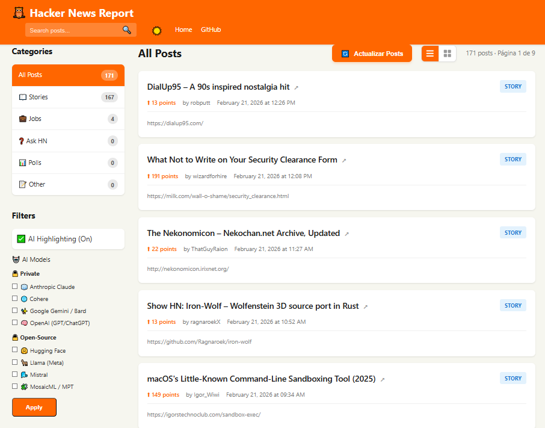

# Hackernews Report

Una aplicación para obtener, categorizar, visualizar y reportar posts de Hacker News, disponible tanto en línea de comandos, interfaz web moderna y como un **servidor MCP** (Model Context Protocol).



## Características

- 📥 Obtiene posts de la API pública de Hacker News
- 💾 Almacena posts localmente en una base de datos SQLite
- 🏷️ Categoriza posts automáticamente (story, job, ask, poll, other)
- 🧠 **Etiquetado Inteligente**: Detecta tecnologías y temas (AI, Python, Rust, etc.) en los títulos.
- 🔦 **Búsqueda Avanzada**: Busca por texto, autor, tags, rango de fechas y puntaje.
- 📊 **Generación de Reportes**: Exporta datos en Markdown, HTML, CSV, JSON y Texto plano.
- 🌐 **Interfaz Web Moderna**:
  - Diseño responsive y modo oscuro.
  - Filtrado por categorías y tags.
  - **Highlighting de IA**: Resalta términos clave de IA automáticamente.
  - Sección de "Blogs de Investigación".
  - Exportación directa de reportes desde la UI.
- 🤖 **Integración MCP (Model Context Protocol)**:
  - Servidor compatible con FastMCP de Anthropic.
  - Expone funciones a LLMs (Claude Desktop, Cursor) para buscar posts locales o traer nuevos desde la API.
  - Herramientas añadidas para extraer detalles de post o explorar directamente en tu navegador local las URLs de interés sobre Inteligencia Artificial.
- 🔄 Manejo robusto de errores con reintentos automáticos.
- ✅ Suite completa de pruebas (unitarias, property-based, integración).

## Estructura del Proyecto

```
hackernews-report/
├── src/
│   ├── __init__.py         
│   ├── __main__.py         # Punto de entrada CLI
│   ├── config.py           
│   ├── models.py           # Modelos (Post, Category, SearchQuery)
│   ├── database.py         # Capa de datos SQLite
│   ├── api_client.py       # Cliente HN API
│   ├── service.py          # Servicio de obtención de datos
│   ├── search_service.py   # Lógica de búsqueda y resaltado
│   ├── search_engine.py    # Motor de búsqueda SQL
│   ├── report_service.py   # Generación de reportes multiformato
│   ├── tags.py             # Sistema de etiquetado
│   ├── cli.py              # Interfaz de línea de comandos
│   ├── web_app.py          # Punto de entrada Web App
│   └── web/                # Paquete de la aplicación Web
│       ├── __init__.py     # Factory de la app Flask
│       ├── routes.py       # Rutas y controladores
│       ├── services.py     # Inyección de dependencias web
│       ├── filters.py      # Filtros de template (fechas, markdown)
│       └── db.py           # Gestión de conexión DB web
├── mcp-hackernews/         # Servidor MCP de Hackernews-Report
│   ├── pyproject.toml      # Configuración de paquete MCP
│   ├── server.py           # Punto de entrada del servidor FastMCP
│   └── README.md           # Instrucciones específicas de la integración MCP
├── templates/              # Templates HTML (Jinja2)
├── static/                 # CSS y Assets
├── tests/                  # Suite de pruebas
└── requirements.txt        
```

## Instalación

1. Clonar el repositorio:

```bash
git clone <repository-url>
cd hackernews-report
```

1. Crear un entorno virtual e instalar dependencias básicas:

```bash
python -m venv .venv
# Windows:
.venv\Scripts\activate
# Linux/Mac:
source .venv/bin/activate

pip install -r requirements.txt
```

*(Opcional) Si quieres habilitar el servidor MCP, visita la sección de [Servidor MCP](#servidor-mcp) más abajo para instalar sus dependencias.*

## Uso

### Interfaz de Línea de Comandos (CLI)

La aplicación se ejecuta como un módulo de Python:

```bash
python -m src <command> [options]
```

#### Comandos Disponibles

**1. Obtener Posts**
Descarga los top posts actuales.

```bash
python -m src fetch --limit 50
```

**2. Buscar Posts**
Busca por texto, autor o tags.

```bash
python -m src search "python" --min-score 100
python -m src search --tags AI --author pg
```

**3. Generar Reportes**
Genera archivos con los resultados de búsqueda.

```bash
# Reporte Markdown de posts de IA
python -m src report --tags AI --format markdown --output reporte_ai.md

# Reporte HTML de mejores historias
python -m src report --category story --min-score 200 --format html --output top_stories.html

# Reporte JSON de búsqueda de texto
python -m src report --text "LLM" --format json
```

**4. Listar y Estadísticas**

```bash
python -m src list --category story
python -m src categories
```

### Interfaz Web

Inicia el servidor web:

```bash
python -m src.web_app
```

Accede a **<http://localhost:5000>** en tu navegador.

#### Características Web

- **Dashboard**: Vista general de posts con filtros.
- **Búsqueda**: Barra de búsqueda integrada.
- **Sidebars**:
  - Navegación por categorías.
  - Nube de Tags populares.
  - **Blogs de Investigación**: Enlaces rápidos a Google DeepMind, OpenAI, Anthropic.
  - **Exportar Reporte**: Botones para descargar la vista actual en MD, HTML, CSV, JSON.
- **AI Highlight**: Toggle para resaltar términos de IA en los títulos.

### Servidor MCP

El proyecto ahora cuenta con un servidor integrado basado en FastMCP para exponer las funcionalidades a inteligencias artificiales locales, agentes y editores de código modernos (como Claude Desktop o Cursor).

Para instalarlo (con el entorno virtual activado):

```bash
cd mcp-hackernews
pip install -e .
```

Una vez instalado, el servidor registrará el comando global `mcp-hn` dentro de tu entorno de Python que puedes correr, enlazar en la app de Claude, o invocar directamente con compatibilidad `stdio`.

Consulta todas las instrucciones específicas, incluyendo cómo enlazar las rutas absolutas dentro del `claude_desktop_config.json`, en el **[README del Subproyecto MCP](mcp-hackernews/README.md)`.

## API Endpoints

La aplicación web también expone una API JSON:

```bash
# Obtener posts (filtrados opcionalmente)
curl "http://localhost:5000/api/posts?category=story&limit=10"

# Obtener estadísticas de tags
curl http://localhost:5000/api/tags

# Obtener estadísticas de categorías
curl http://localhost:5000/api/stats
```

## Desarrollo y Pruebas

Ejecutar la suite de pruebas:

```bash
pytest
```

Ver cobertura:

```bash
pytest --cov=src --cov-report=html
```

## Licencia

[MIT](LICENSE)

## Enlaces

- **Repositorio**: <https://github.com/iJKENNEDY/hackernews-report>
- **Hacker News API**: <https://github.com/HackerNews/API>
